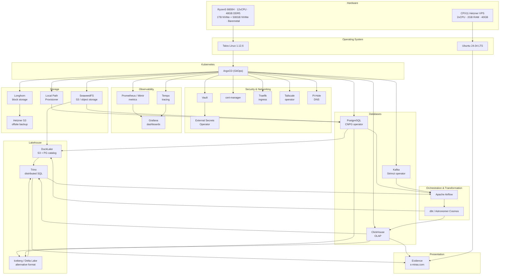

# Kubernetes Lab Environment

Repo designated for managing and documenting everything I am running.

## Servers Overview

```
AMD Ryzen5 6600H / Talos 1.12.6 baremetal
    ├── 6 CPU / 12 vCPU
    ├── 48GB DDR5 4800 RAM
    ├── 1TB NVMe SSD (200GB EPHEMERAL, 800GB local path provisioner)
    └── 500GB NVMe SSD (longhorn provisioner)

AMD CPX11 / Ubuntu 24.04.4 LTS (Hetzner VPS)
    ├── 2 vCPU
    ├── 2GB RAM
    └── 40GB Disk
```

## Roadmap

Tools and technologies I am currently running or plan to run in the lab environment.

### Infrastructure & Platform

- [x] **Talos Linux** - Immutable Kubernetes OS
- [x] **ArgoCD** - GitOps continuous deployment
- [x] **Longhorn** - Distributed block storage
- [x] **Vault + External Secrets Operator** - Secret management
- [ ] **VPA** - Vertical Pod Autoscaler for resource optimization
- [ ] **HPA** - Horizontal Pod Autoscaler example
- [ ] **KEDA** - Kubernetes Event-Driven Autoscaling example

### Observability (LGTM Stack)

- [x] **Grafana** - Visualization and dashboards
- [x] **Tempo** - Distributed tracing
- [x] **Mimir/Prometheus** - Metrics storage and querying
- [ ] **Loki** - Log aggregation
- [ ] **Alloy** - Telemetry collection

### Data Platform

- [x] **Cloud Native PostgreSQL (CNPG) operator** - PostgreSQL
- [x] **ClickHouse operator** - ClickHouse
- [x] **SeaweedFS** - Object storage / S3
- [x] **DuckLake** - SeaweedFS S3 + PostgreSQL backed Lakehouse
- [x] **Apache Airflow** - Workflow orchestration
- [x] **DBT/Astronomer cosmos** - Data transformation and orchestration
- [x] **ClickHouse** - OLAP database
- [x] **Trino** - Distributed SQL query engine
- [x] **Apache Iceberg/Delta Lake** - Alternative lakehouse
- [ ] **OpenMetadata** - Data discovery and governance

### Optional/Future

- [x] **Pi-Hole** - Tail'net-wide ad blocker / dns override
- [x] **Evidence blog** - s-miras.com (VPS)
- [x] **Hetzner Offsite S3** - longhorn backup target
- [ ] **Kubevirt** - VMs in Kubernetes

## Architecture



## Directory Structure

```
lab/
├── dags/             # Airflow DAGs / Cosmos dbt projects
├── docs/             # Documentation
├── infra/            # Helm charts, ArgoCD apps, Talos conf files, etc.
└── web/              # s-miras.com evidence website / blog
```
